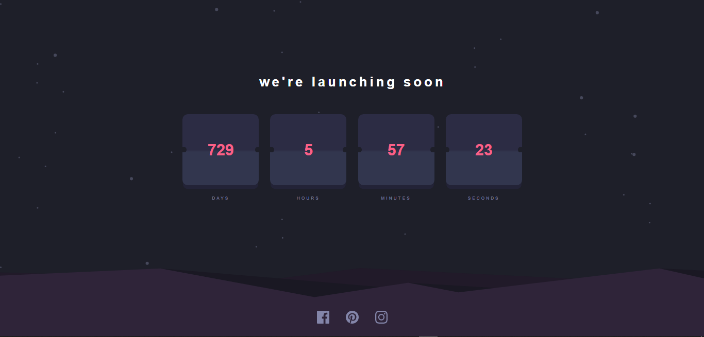

# Frontend Mentor - Launch countdown timer solution

This is a solution to the [Launch countdown timer challenge on Frontend Mentor](https://www.frontendmentor.io/challenges/launch-countdown-timer-N0XkGfyz-). Frontend Mentor challenges help you improve your coding skills by building realistic projects. 

## Table of contents

- [Overview](#overview)
  - [The challenge](#the-challenge)
  - [Screenshot](#screenshot)
  - [Links](#links)
- [My process](#my-process)
  - [Built with](#built-with)
  - [What I learned](#what-i-learned)
  - [Continued development](#continued-development)
- [Author](#author)

**Note: Delete this note and update the table of contents based on what sections you keep.**

## Overview

### The challenge

Users should be able to:

- See hover states for all interactive elements on the page
- See a live countdown timer that ticks down every second (start the count at 14 days)
- **Bonus**: When a number changes, make the card flip from the middle

### Screenshot



### Links

- Solution URL: [see solution](https://www.frontendmentor.io/solutions/responsive-landing-page-using-webpack-and-scss-mixins-khp0AoiiAm)
- Live Site URL: [see live](https://launch-countdown-timer-marc12.netlify.app/)

## My process

### Built with

- Semantic HTML5 markup
- SCSS variables
- Flexbox
- Mobile-first workflow
- Reactjs framework

### What I learned

To day's challenge was a great was to learn how to work with reactjs useState and useEffect, work with Date() function.

```html
<h1>Some HTML code I'm proud of</h1>
```
```jsx
function App() {
  const [setDays, setDaysState] = useState();
  const [setHours, setHoursState] = useState();
  const [setMinutes, setMinutesState] = useState();
  const [setSeconds, setSecondsState] = useState();

  let interval ;

  const startTimer = () => {
    const countDown = new Date ('Jully 4, 2024').getTime();

    interval = setInterval(() => {
      const nowDate = new Date().getTime();
      const difference = countDown - nowDate;

      // Now we need to get the days, hours, minutes and seconds, by dividing the difference by 1000, 60, 60 and 24 respectively.
      const days = Math.floor(difference / (1000 * 60 * 60 * 24));

      const hours = Math.floor((difference % (1000 * 60 * 60 * 24)) / (1000 * 60 * 60));

      const minutes = Math.floor((difference % (1000 * 60 * 60)) / (1000 * 60));

      const seconds = Math.floor((difference % (1000 * 60)) / 1000);

      // Now we need a condition to check how long the inteval should run
      // we clear the interval if the difference is less than 0
      if (difference < 0) {
        clearInterval(interval);
      } else {

        // update the timer constantly
        setDaysState(days);
        setHoursState(hours);
        setMinutesState(minutes);
        setSecondsState(seconds);
      }
   });
  }

  // now we need to load the timer when the page loads
  useEffect(() => {
    startTimer();
  })
  return (
    <div className="App">
     <Clock setDays={setDays} setHours={setHours} setMinutes={setMinutes} setSeconds={setSeconds} />
    </div>
  );
}

```

### Continued development
- CSS animations

## Author
- Frontend Mentor - [@Marcraphael12](https://www.frontendmentor.io/profile/Marcraphael12)
- GitHub - [@Marcraphael12](https://github.com/Marcraphael12)